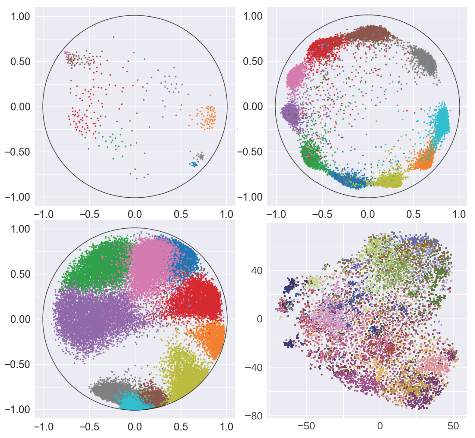

# Efficient Linear Classification in Hyperbolic Space

### [Highly Scalable and Provably Accurate Classification in Poincaré Balls (ICDM regular, 2021)](https://arxiv.org/pdf/2109.03781.pdf)

Programming language: Python 3.7. Tested on operating systems: Windows 10, CentOS 7.7.1908

# Poincaré Embedding for Real Datasets


**Figure 1.** Visualization of four embedded data sets. Different colors represent different classes.
- Olsson’s single-cell RNA expression data [1] (top left, K = 8, d = 2)
- CIFAR10 [2] (top right, K = 10, d = 2)
- Fashion-MNIST [3] (bottom left, K = 10, d = 2)
- Mini-ImageNet [4] (bottom right, K = 20, d = 512)

Here K stands for the number of classes and d stands for the dimension of embedded Poincaré ball. Data points from mini-ImageNet are mapped into 2 dimensions using tSNE for viewing purposes only and thus may not lie in the unit Poincaré disk.

# Linear Classification in Hyperbolic Space

### Perceptron

The Jupyter notebook `HP_single_exp.ipynb` contains a demo to run our hyperbolic perceptron algorithms, hyperbolic perceptron from [5] and Euclidean perceptron on synthetic data with visualization.

**Our Results** are shown in the following figure and table.


**Table 1.** 

### SVM


# TBA


To reproduce our experiments of Fig 7 and Table 1
```
python Synthetic_exp.py --savepath [your saving path] 
```
The experimental setting that can be changed are listed as follows: \
--N: Number of points (default: 100000) \
--d: Dimension (default: 2) \
--gamma: Margin (default: 0.01) \
--R: Upper bound of the norm of data points (default: 0.95) \
--a: The hyperparameter in the second order perceptron (default: 0) \
--thread: Number of threads used for parallelization (default: 20) \
--chucksize: Chucksize for parallelization (default: 1) \
--Repeat: Number of repeat of experiments (default: 20) 

Note that you can comment out some methods that you don't want to test in the file `Synthetic_exp.py`. We have a more detail instruction in it. 

The output will be saved as a (3,5,Repeat) numpy arrany. \
First axis: acc, mistakes (for perceptron only), running time. \
Second axis: methods. They are our hyperbolic perceptron, our second order hyperbolic perceptron, our hyperbolic SVM, SVM from Cho et al., Euclidean SVM.

# More details about the usage TBA

# How to choose the reference point p
TBA

## Contact
Please contact Chao Pan (chaopan2@illinois.edu), Eli Chien (ichien3@illinois.edu) if you have any question.
