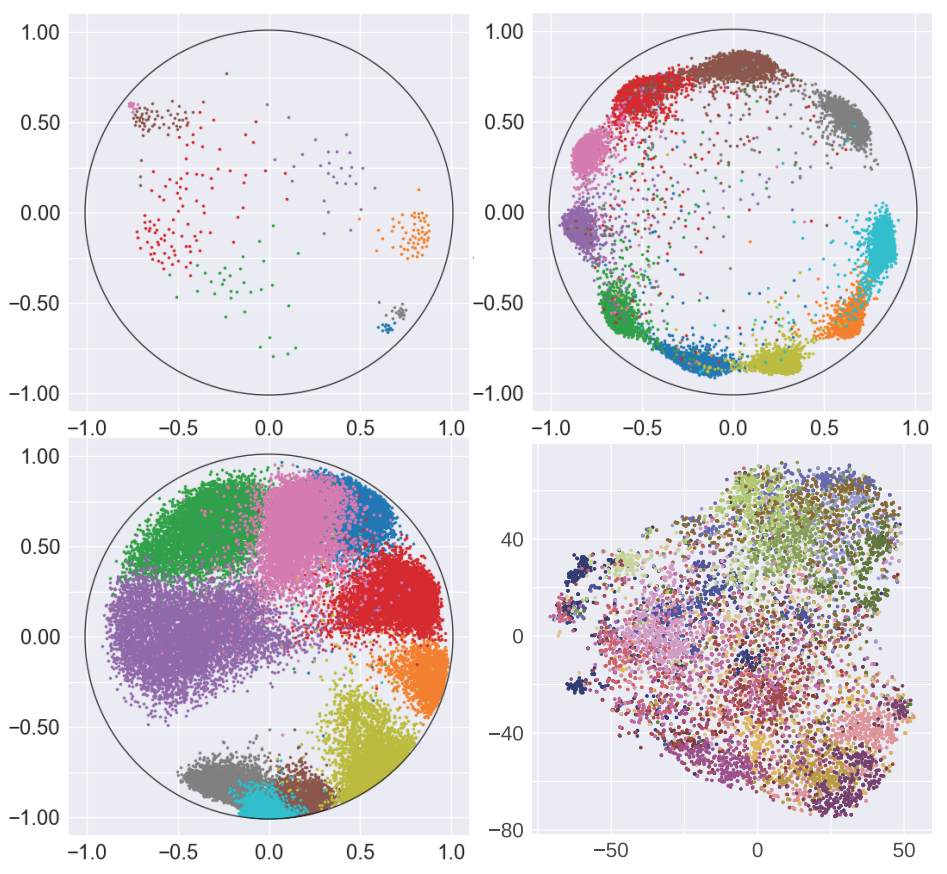
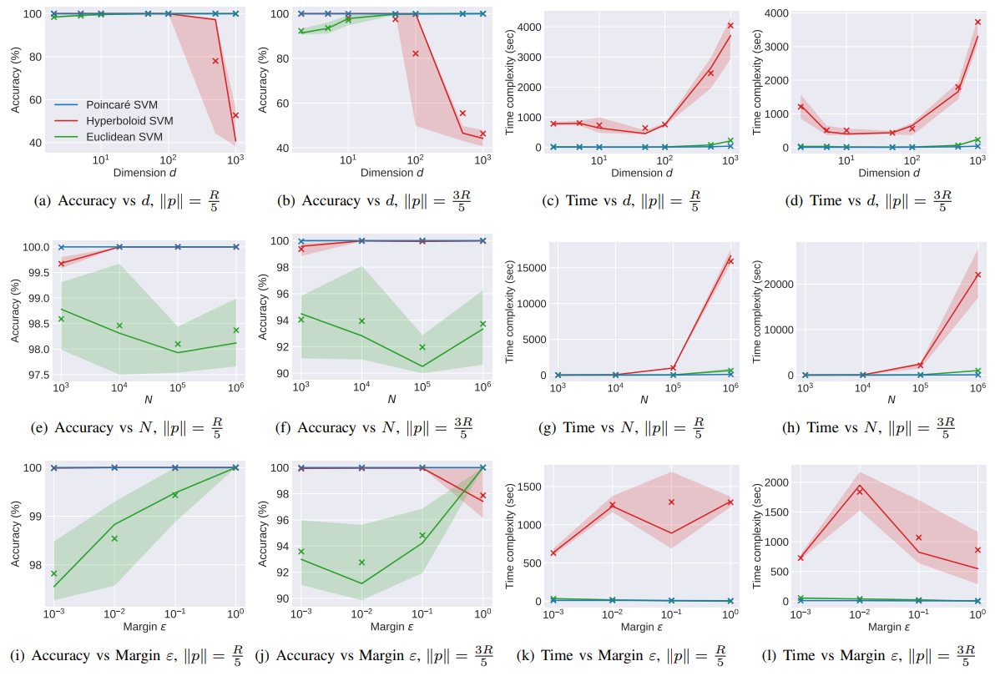
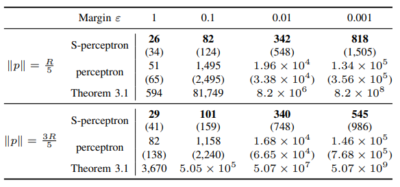
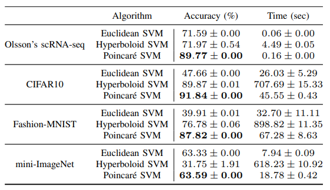

# Efficient Linear Classification in Hyperbolic Space
[](https://zenodo.org/badge/latestdoi/401898578)

### [Highly Scalable and Provably Accurate Classification in Poincaré Balls (ICDM regular, 2021)](https://arxiv.org/pdf/2109.03781.pdf)

Programming language: Python 3.7. Tested on operating systems: Windows 10, CentOS 7.7.1908

# Poincaré Embedding for Real Datasets


**Figure 1.** Visualization of four embedded data sets. Different colors represent different classes.
- Olsson’s single-cell RNA expression data [1] (top left, K = 8, d = 2)
- CIFAR10 [2] (top right, K = 10, d = 2)
- Fashion-MNIST [3] (bottom left, K = 10, d = 2)
- Mini-ImageNet [4] (bottom right, K = 20, d = 512)

Here K stands for the number of classes and d stands for the dimension of embedded Poincaré ball. Data points from mini-ImageNet are mapped into 2 dimensions using tSNE for viewing purposes only and thus may not lie in the unit Poincaré disk. RNA expression data is processed following the method described in [5]. The other three are processed following the method described in [6]. Due to file sizes, we only include the first three datasets in `embedding`. Full datasets can be downloaded [here](https://doi.org/10.13012/B2IDB-6901251_V1).

# Linear Classification in Hyperbolic Space

### Perceptron

Our results about accuracy, time complexity and number of updates w.r.t perceptron are shown in the following figure and table.



**Figure 2.** Experiments on synthetic data sets with different p. The upper and lower boundaries of the shaded region represent the first and third quantile, respectively. The line itself corresponds to the medium (second quantile) and the marker × indicates the mean. The first two columns plot the accuracy of the SVM methods while the last two columns plot the corresponding time complexity. For the first row we vary the dimension d from 2 to 1, 000. For the second row we vary the number of points N from 10<sup>3</sup> to 10<sup>6</sup>. In the third row we vary the margin ε from 1 to 0.001. The default setting for (d, N, ε) is
(2, 10<sup>5</sup>, 0.01).



**Figure 3.** Averaged number of updates for the Poincaré second-order perceptron (S-perceptron) and Poincaré perceptron for a varying margin ε and fixed (N, d) = (10<sup>4</sup>, 10). Bold numbers indicate the best results, with the maximum number of updates over 20 runs shown in parenthesis.

### SVM
Our results about accuracy and time complexity w.r.t SVM are shown in the following table.



**Figure 4.** Performance of the convex Poincaré SVM algorithm. Bold numbers indicate the best results.

# Usage

### Perceptron

The Jupyter notebook `HP_single_exp.ipynb` contains a demo to run our hyperbolic perceptron algorithms, hyperbolic perceptron from [7] and Euclidean perceptron on synthetic data with visualization.

To reproduce our experiments on synthetic data
```
python synthetic_exp.py --savepath=[your saving path] 
```
The experimental setting that can be changed are listed as follows: \
--N: Number of points (default: 100000) \
--d: Dimension (default: 2) \
--gamma: Margin (default: 0.01) \
--R: Upper bound of the norm of data points (default: 0.95) \
--a: The hyperparameter in the second order perceptron (default: 0) \
--thread: Number of threads used for parallelization (default: 20) \
--chucksize: Chucksize for parallelization (default: 1) \
--Repeat: Number of repeat of experiments (default: 20) 

The output will be saved as a (3,5,Repeat) numpy arrany. \
First axis: acc, mistakes (for perceptron only), running time. \
Second axis: methods. They are our hyperbolic perceptron, our second order hyperbolic perceptron, our hyperbolic SVM, SVM from Cho et al., Euclidean SVM.

### SVM

To run experiments on real-world data
```
python svm_real_data.py --dataset_name=[working dataset from 'cifar', 'fashion-mnist', 'olsson' or 'mini'] --trails=[number of repeat] --save_path=[your saving path]
```
Note that SVM is sensitive to the choice of coefficient `C`, which is used in soft-margin classifications.

### Learning reference point p
We implement two specialized methods `ConvexHull` and `QuickHull` for Poincaré ball model in `algos` to compute the reference point in each class. General method of "Graham Scan" is also included in `Graham Scan`. However, in practice one can also find the closest pair of points between two classes and use their midpoint as the reference point instead of computing the convex hull, since the latter approach is time consuming especially when dimension is large.

Note that when the classes are highly overlapped, we may want to adjust some of the reference points manually based on training data to achieve better performance. Our pre-computed reference points are included in `embedding`.

# Contact
Please contact Chao Pan (chaopan2@illinois.edu), Eli Chien (ichien3@illinois.edu) if you have any question.

# References
[1] A. Olsson, M. Venkatasubramanian, V. K. Chaudhri, B. J. Aronow, N. Salomonis, H. Singh, and H. L. Grimes, “Single-cell analysis of mixed-lineage states leading to a binary cell fate choice,” Nature, vol. 537, no. 7622, pp. 698–702, 2016. \
[2] A. Krizhevsky, G. Hinton et al., “Learning multiple layers of features from tiny images,” 2009. \
[3] H. Xiao, K. Rasul, and R. Vollgraf, “Fashion-mnist: a novel image dataset for benchmarking machine learning algorithms,” arXiv preprint arXiv:1708.07747, 2017. \
[4] S. Ravi and H. Larochelle, “Optimization as a model for few-shot learning,” in International Conference on Learning Representations, 2017. \
[5] A. Klimovskaia, D. Lopez-Paz, L. Bottou, and M. Nickel, “Poincaré maps for analyzing complex hierarchies in single-cell data,” Nature communications, vol. 11, no. 1, pp. 1–9, 2020. \
[6] V. Khrulkov, L. Mirvakhabova, E. Ustinova, I. Oseledets, and V. Lempitsky, “Hyperbolic image embeddings,” in Proceedings of the IEEE/CVF Conference on Computer Vision and Pattern Recognition, 2020, pp. 6418–6428. \
[7] Weber, Melanie, et al. "Robust large-margin learning in hyperbolic space." arXiv preprint arXiv:2004.05465 (2020).


